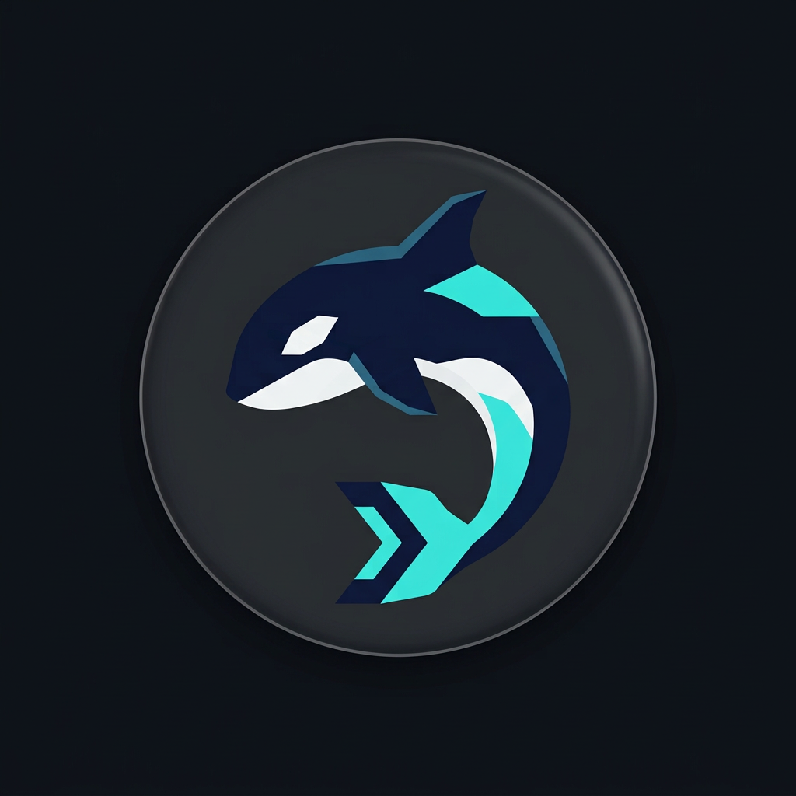

<div align="center">



# Orca Code

**The apex predator of terminal coding agents.**

One static binary · 3 ms cold start · zero dependencies · security-first

[](https://github.com/Nethyric/orca-code/actions/workflows/ci.yml)
[](https://go.dev)
[](go.mod)
[](LICENSE)
[](#install)

[Install](#install) · [Quick start](#quick-start) · [Security model](#the-security-model) · [Providers](#providers) · [Configuration](#configuration) · [Architecture](#architecture)

</div>

---

```text
╭─ orca ── deep ocean ──────────────────────────────────╮
│  model  anthropic/claude-sonnet-4-5                   │
│  root   ~/projects/webapp                             │
│  mode   default   v1.0.0 · /help for commands         │
╰───────────────────────────────────────────────────────╯
orca ❯ add rate limiting to the API and prove it works
◆ grep(func.*Handler)
  ↳ api/routes.go:24: func RegisterHandlers(…
◆ read_file(api/routes.go)
  ↳ 142 lines
◆ edit_file(api/routes.go)
  ↳ Edited api/routes.go (1 replacement)
◆ write_file(api/ratelimit_test.go)
  ↳ Wrote api/ratelimit_test.go (58 lines)
◆ bash(go test ./...)
  ↳ ok · 8 packages
⌁ tokens 12.4k in / 1.8k out · $0.0621
```

Orca Code is an autonomous coding agent that lives in your terminal. It reads
and edits files, runs commands, searches the web, verifies its own work with
your test suite and finishes multi-file changes end-to-end — with **your**
provider, **your** keys and **your** budget. Every risky action passes through
a permission engine designed like a security product, not a chatbot wrapper.

## Why Orca

|   |   |
|---|---|
| ⚡ **Instant** | Single ~6 MB static binary, **3.4 ms** cold start. No Python, no Node, no `npm install`, no virtualenv. Download → run. |
| 🔒 **Secure by architecture** | Project-root confinement (symlink-aware), argv-level command allowlisting, connect-time SSRF guard, trust gate for repo configs, `0600` key storage. [Details ↓](#the-security-model) |
| 🌐 **Provider-agnostic** | 11 first-class providers + anything OpenAI-compatible. Swap Claude for a local Ollama model with one flag. |
| 💰 **Budget-aware** | Live token/cost meter, hard session cost caps, auto-compaction that summarises old history instead of silently dropping it. |
| ↩️ **Reversible** | Every write is snapshotted byte-exact — `/undo` reverts the agent's last turn, binaries included. |
| 🧪 **Actually tested** | 39 test functions across 8 packages, race-detector clean on Linux/macOS/Windows, including SSE streaming against mock servers and symlink-escape / SSRF attack cases. |
| 📦 **Zero supply chain** | `go.mod` is three lines. Everything is the Go standard library — nothing to audit but this repo. |

## Install

**Linux / macOS** (downloads the right prebuilt binary):

```bash
curl -fsSL https://raw.githubusercontent.com/Nethyric/orca-code/main/install.sh | sh
```

**Windows:** grab `orca-windows-amd64.exe` from [Releases](../../releases).

**From source** (Go 1.23+):

```bash
go install github.com/Nethyric/orca/cmd/orca@latest
```

> Using GNOME's Orca screen reader? Its binary is also called `orca` — install
> ours under another name: `ORCA_INSTALL_DIR=~/.local/bin sh install.sh && mv ~/.local/bin/orca ~/.local/bin/orcacode`

## Quick start

```bash
export ANTHROPIC_API_KEY=sk-ant-…      # or OPENAI_API_KEY, GROQ_API_KEY, …
cd your-project
orca                                   # interactive session
```

```bash
orca -p "fix the failing test" --yes   # one-shot, non-interactive
orca --provider ollama --model qwen3:14b   # fully local, no key, no cloud
orca --mode plan -p "how would you add OAuth?"   # read-only exploration
orca --max-cost 2.50                   # hard budget for this session
```

Store a key once instead of exporting it: `orca key openai sk-…` — saved to
`~/.orca/keys.json` with `0600` permissions.

## The security model

An agent that runs shell commands is an attack surface. Orca treats it that
way — four independent layers, none of which is a regex blacklist:

| Layer | What it stops |
|---|---|
| **Default-ask permissions** | Nothing that mutates state runs unapproved. Auto-approval exists only for an argv-validated allowlist of read-only commands — `git status` passes, `git difftool -x anything` asks. |
| **Project-root confinement** | Absolute paths, `..` traversal and symlink hops out of the project are blocked — the agent cannot touch `~/.ssh` or `~/.bashrc`. Opt out only with `--allow-outside-root`. |
| **Metacharacter gate** | Any quote, pipe, redirect, substitution, glob or assignment in a command disables auto-approval. `ls; rm -rf ~` always asks. |
| **SSRF guard** | Web tools validate the **resolved IP at connect time** (immune to DNS rebinding): loopback, RFC1918, link-local/cloud-metadata and CGNAT ranges are unreachable, and every redirect is re-validated. |

Plus two boundaries most agents skip:

- **Repo trust gate** — `hooks` and `verify_command` inside a project's
  `.orca/settings.json` stay inert until you run `orca trust` there. Cloning a
  malicious repository and opening Orca in it executes nothing.
- **Catastrophic-command backstop** — `rm -rf /`, `mkfs`, fork bombs and
  friends are refused in *every* mode, even `yolo`.

Full policy and disclosure process: [SECURITY.md](SECURITY.md).

## Permission modes

| Mode | Reads | Edits | Shell | Web |
|---|:-:|:-:|:-:|:-:|
| `default` | ✓ | ask | ask · safe read-only auto | ask |
| `acceptEdits` | ✓ | ✓ | ask | ask |
| `plan` | ✓ | ✗ | ✗ | ✗ |
| `yolo` | ✓ | ✓ | ✓ (backstop active) | ✓ |

Answer `a` at any prompt to allow that action class for the session, or
persist rules like `bash(go test *)` / `edit_file(src/*)` in config. Deny
rules always beat allow rules.

## Providers

`anthropic` · `openai` · `openrouter` · `groq` · `deepseek` · `mistral` ·
`together` · `xai` · `google` · `moonshot` · `ollama`

Both native wire formats are implemented — **Anthropic Messages** and
**OpenAI Chat Completions** — with real SSE streaming, capped exponential
backoff with jitter, and `Retry-After` compliance. Anything speaking the
OpenAI dialect works via `ORCA_BASE_URL` (LM Studio, vLLM, llama.cpp, custom
gateways).

## Tools

| Tool | Notes |
|---|---|
| `read_file` `write_file` `edit_file` | exact-match editing with closest-match hints on failure; every write snapshotted for `/undo` |
| `bash` | project-root cwd, timeouts, output truncation |
| `grep` `glob` `ls` | `.gitignore`-aware (including `!negation`), binary-safe, `**` globs |
| `todo` | structured task list for multi-step work |
| `web_fetch` `web_search` | SSRF-guarded, HTML→text extraction, keyless search |

## Configuration

```jsonc
// ~/.orca/config.json (global) — .orca/settings.json (per project)
{
  "provider": "anthropic",
  "model": "claude-sonnet-4-5",
  "mode": "default",
  "max_cost_usd": 5.0,
  "compact_chars": 300000,           // auto-compaction threshold (-1 disables)
  "allow": ["bash(go test *)", "bash(git *)"],
  "deny":  ["bash(git push*)"],
  // executable settings — require `orca trust` when set by a project:
  "verify_command": "go test ./...", // runs after every edit; failures feed back to the model
  "hooks": { "after_edit": "gofmt -w %file" }
}
```

Env overrides: `ORCA_PROVIDER`, `ORCA_MODEL`, `ORCA_MODE`, `ORCA_BASE_URL`,
`ORCA_API_KEY`, `ORCA_HOME`.

Sessions are persisted as JSONL under `~/.orca/sessions/`. Long conversations
are auto-compacted: older turns are summarised by the model itself and the
summary is kept as authoritative history — recent turns stay verbatim.

## Architecture

```text
cmd/orca            CLI entry, REPL, one-shot mode
internal/
  agent/            the loop: stream → permissions → tools → verify → repeat
                    auto-compaction · cost caps · session logging
  security/         path confinement · command classification · SSRF guard
  permissions/      allow / ask / deny engine, glob rules, 4 modes
  tools/            file IO · search · shell · web · byte-exact undo
  provider/         anthropic + openai SSE streaming, retry, backoff
  config/           layered config · repo trust gate · 0600 key store
  session/          JSONL persistence
  ignore/           full .gitignore semantics (ordered rules, negation)
  ui/               ANSI rendering, NO_COLOR-aware, non-TTY safe
```

Design rules the codebase follows:

1. **The default is deny/ask.** Allowlists decide what may *skip the prompt* —
   they are never the last line of defence.
2. **Every security claim has a test.** Symlink escapes, `difftool`-style
   flag smuggling, DNS-rebinding SSRF, binary undo integrity — all covered in CI.
3. **stdlib only.** A coding agent should not ship 300 transitive dependencies.

## Product research and design

- [Competitive research](docs/orca-competitive-research.md) — official-source comparison, user pain points, capability matrix and prioritized roadmap
- [Design system](docs/orca-design-system.md) — ORCA visual tokens, typography, accessibility and desktop layout contract
- [Architecture contract](docs/orca-architecture.md) — current implementation boundaries and the future CLI/desktop protocol
- [QA matrix](docs/qa-matrix.md) — verified platform checks and explicitly documented gaps

The current release is a terminal agent. A desktop IDE, LSP, MCP, semantic
index, inline completion and OS-level sandbox are planned rather than silently
claimed as shipped.

## Roadmap

- [ ] MCP client — connect external tool servers
- [ ] LSP diagnostics fed into the loop
- [ ] Subagents with scoped tool access
- [ ] Git-aware workflows (auto-branch, review-ready diffs)
- [ ] OS-level sandboxing for `bash` (Landlock / Seatbelt / AppContainer)

## Contributing

`make test` must stay green and `go vet` clean. Security-relevant changes
need tests demonstrating the attack they block. For vulnerabilities use
[private disclosure](SECURITY.md) — not public issues.

## License

[MIT](LICENSE) © Nethyric and contributors

---

<div align="center">

**If Orca saves you an afternoon, a ⭐ helps other developers find it.**

</div>
