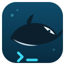

<p align="center">
  
</p>

<h1 align="center">Orca Code</h1>

<p align="center">
  <strong>The zero-dependency AI coding agent.</strong><br>
  Your keys, your providers, your budget — in any terminal.
</p>

<p align="center">
  <a href="https://github.com/Nethyric/orca-code/actions/workflows/ci.yml"></a>
  <a href="https://www.python.org/downloads/"></a>
  
  
  <a href="LICENSE"></a>
  
</p>

<p align="center">
  <a href="docs/installation.md">Install</a> ·
  <a href="docs/providers.md">Providers</a> ·
  <a href="docs/cli.md">CLI &amp; Tools</a> ·
  <a href="docs/configuration.md">Configuration</a> ·
  <a href="docs/why-orca.md">Why Orca</a> ·
  <a href="docs/ui-showcase.html">UI Showcase</a>
</p>

<pre lang="text">
╭─ orca ─── deep ocean ───────────────────────────────╮
│ ◆ read_file(orc/webapp.py)                          │
│   ↳ 142 lines                                       │
│ ◆ write_file(orc/static/app.js)                     │
│ ◆ bash(python3 -m http.server 8000)                 │
│   ↳ serving · 3 files · game complete               │
│ ⌁ thinking · models: 31 · ctx 12.4k/200k ▮▮▮░░░░    │
╰─────────────────────────────────────────────────────╯
</pre>

Orca Code is an agentic coding tool that lives in your terminal: it reads and edits
files, runs commands, searches the web, checks its own work, and finishes
multi-file builds end-to-end. It's built from scratch on **pure Python stdlib**
around three principles: **your providers, your budget, your terminal.**

## Installation

```bash
# macOS / Linux (any POSIX shell)
curl -fsSL https://raw.githubusercontent.com/Nethyric/orca-code/main/install.sh | bash
```

```powershell
# Windows (PowerShell)
irm https://raw.githubusercontent.com/Nethyric/orca-code/main/install.ps1 | iex
```

No git required — both installers pull the repo zip directly.

**No Python at all?** Each [release](https://github.com/Nethyric/orca-code/releases)
ships standalone executables for Linux and Windows (x64 + ARM64) and macOS
(Apple Silicon), plus `orca.pyz` (one file, runs anywhere Python 3.9+
is installed).

Alternative methods (pip, pipx, venv, offline, from source):

```bash
pip install https://github.com/Nethyric/orca-code/archive/refs/heads/main.zip
```

> The full walkthrough lives in the **[installation guide](docs/installation.md)**.
> cmd.exe works with an automatic clean ASCII look; Windows Terminal gets the
> full Deep Ocean UI.

## Get started

```bash
orca auth login        # pick a provider, paste a key — it's validated live
orca                   # start the REPL in any project
```

One-shot mode works too:

```bash
orca -p "explain the auth flow in this repo"
orca -p "add dark mode to the site" --allow-write
```

## Highlights

- **31 providers, one command** — OpenAI, Anthropic, Google, xAI, Groq, DeepSeek,
  Moonshot (Kimi), Z.ai (GLM), OpenRouter, Mistral, Ollama, and 20 more; any
  OpenAI-compatible endpoint via `custom`. Keys are validated against the
  provider's live model list before they're saved.
- **Zero dependencies** — pure Python 3.9+ stdlib. Nothing to break on upgrade.
- **Battle-tested** — [Orca: Deep Runner](https://github.com/Nethyric/orca-deep-runner),
  a complete HTML5 game (18 files, ~2,600 lines, 90 tests), was built by Orca
  in one continuous agent session.
- **Live cost ceiling** — every response shows spend so far; `max_cost_usd` stops
  the agent mid-run, not after the invoice.
- **Subagents** — the `task` tool spawns a scoped helper (read-only `explore`
  or full `general`, no nesting) with a shared cost budget.
- **Lifecycle hooks** — `before_bash` can veto a command; `after_edit` /
  `after_bash` run your formatter or linter on every change.
- **Real rewind** — `/undo` restores files *and* conversation state.
- **Verification gates** — optional `verify_command` runs your tests before an
  edit is accepted.
- **Thinking streams** — reasoning is shown live (dim, italic) but never stored,
  so context stays clean.
- **Local-first** — Ollama and LM Studio need no account, no key, no internet.
- **182 offline tests** — CI matrix on Python 3.9–3.13, no network, no keys.

## Documentation

| Doc | What's inside |
| --- | --- |
| [Installation](docs/installation.md) | pip, pipx, venv, Windows, offline, from source, uninstall |
| [Providers](docs/providers.md) | all 31 providers, env vars, examples, custom endpoints |
| [CLI & Tools](docs/cli.md) | every command, slash command, and tool the agent can use |
| [Configuration](docs/configuration.md) | config.json reference, themes, budgets, permissions |
| [Why Orca](docs/why-orca.md) | the complaint-driven design notes behind each feature |
| [UI Showcase](docs/ui-showcase.html) | what the terminal UI looks like, feature by feature |

## Contributing

Bug reports and pull requests are welcome at
[github.com/Nethyric/orca-code](https://github.com/Nethyric/orca-code).
Run the suite before submitting:

```bash
python3 -m unittest discover -s tests
```

## License

[MIT](LICENSE) © Orca Code contributors
